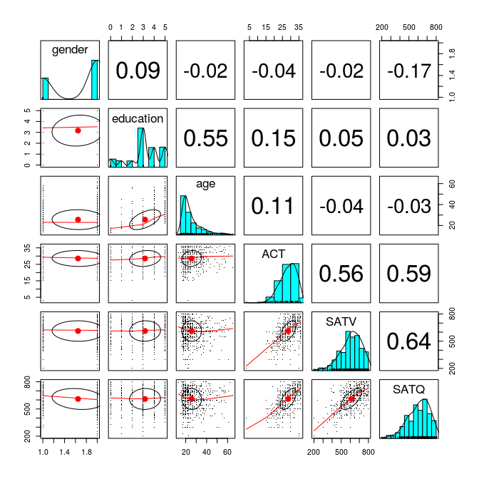
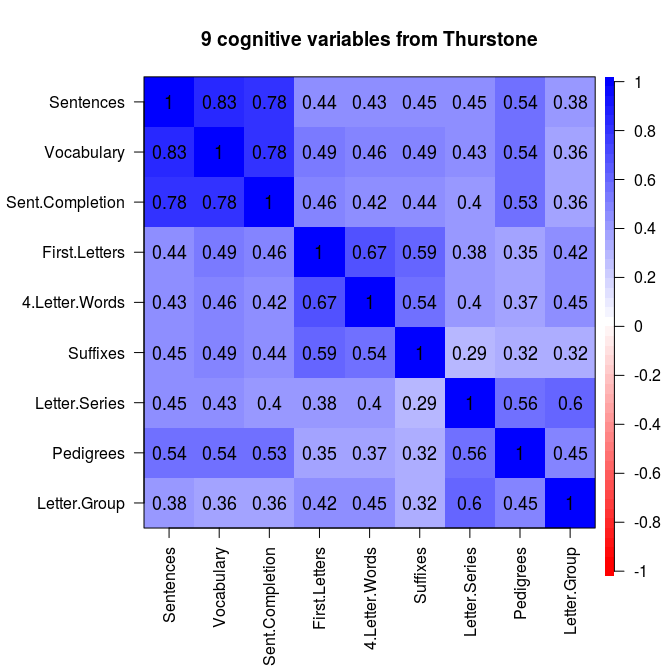
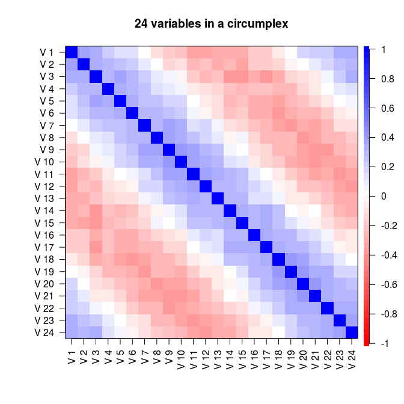

# 01 Introduction


This notebook is based on this tutorial "How To:  Use the psych package for Factor Analysis and datar eduction"
Link: http://personality-project.org/r/psych/HowTo/factor.pdf


## Basic descriptive statistics


```r
library(psych)

data(sat.act)
describe(sat.act)
```

```
          vars   n   mean     sd median trimmed    mad min max range  skew
gender       1 700   1.65   0.48      2    1.68   0.00   1   2     1 -0.61
education    2 700   3.16   1.43      3    3.31   1.48   0   5     5 -0.68
age          3 700  25.59   9.50     22   23.86   5.93  13  65    52  1.64
ACT          4 700  28.55   4.82     29   28.84   4.45   3  36    33 -0.66
SATV         5 700 612.23 112.90    620  619.45 118.61 200 800   600 -0.64
SATQ         6 687 610.22 115.64    620  617.25 118.61 200 800   600 -0.59
          kurtosis   se
gender       -1.62 0.02
education    -0.07 0.05
age           2.42 0.36
ACT           0.53 0.18
SATV          0.33 4.27
SATQ         -0.02 4.41
```

## Correlational structure
There  are  many  ways  to  display  correlations.   Tabular  displays  are  probably  the  most common.  The output from the cor function in core R is a rectangular matrix.
lowerMat will  round  this  to  (2)  digits  and  then  display  as  a  lower  o   diagonal  matrix. lowerCor calls cor with use=`pairwise',  method=`pearson' as default values and returns (invisibly) the full correlation matrix and displays the lower o  diagonal matrix


```r
lowerCor(sat.act)
```

```
          gendr edctn age   ACT   SATV  SATQ 
gender     1.00                              
education  0.09  1.00                        
age       -0.02  0.55  1.00                  
ACT       -0.04  0.15  0.11  1.00            
SATV      -0.02  0.05 -0.04  0.56  1.00      
SATQ      -0.17  0.03 -0.03  0.59  0.64  1.00
```


```r
pairs.panels(sat.act, pch='.')
```

<!-- -->
Figure 1:  Using the pairs.panels function to graphically show relationships.  The x axis
in each scatter plot represents the column variable, the y axis the row variable.  Note the
extreme outlier for the ACT. The plot character was set to a period (pch='.')  in order to
make a cleaner graph.


```r
female <- subset(sat.act,sat.act$gender==2)
male <- subset(sat.act,sat.act$gender==1)
lower <- lowerCor(male[-1])
```

```
          edctn age   ACT   SATV  SATQ 
education  1.00                        
age        0.61  1.00                  
ACT        0.16  0.15  1.00            
SATV       0.02 -0.06  0.61  1.00      
SATQ       0.08  0.04  0.60  0.68  1.00
```


```r
upper <- lowerCor(female[-1])
```

```
          edctn age   ACT   SATV  SATQ 
education  1.00                        
age        0.52  1.00                  
ACT        0.16  0.08  1.00            
SATV       0.07 -0.03  0.53  1.00      
SATQ       0.03 -0.09  0.58  0.63  1.00
```


```r
both <- lowerUpper(lower,upper)
round(both,2)
```

```
          education   age  ACT  SATV  SATQ
education        NA  0.52 0.16  0.07  0.03
age            0.61    NA 0.08 -0.03 -0.09
ACT            0.16  0.15   NA  0.53  0.58
SATV           0.02 -0.06 0.61    NA  0.63
SATQ           0.08  0.04 0.60  0.68    NA
```

It is also possible to compare two matrices by taking their differences and displaying one (below the diagonal) and the difference of the second from the first above the diagonal


```r
diffs <-  lowerUpper(lower,upper,diff=TRUE)
round(diffs,2)
```

```
          education   age  ACT  SATV SATQ
education        NA  0.09 0.00 -0.05 0.05
age            0.61    NA 0.07 -0.03 0.13
ACT            0.16  0.15   NA  0.08 0.02
SATV           0.02 -0.06 0.61    NA 0.05
SATQ           0.08  0.04 0.60  0.68   NA
```

## Heatmap displays of correlational structure
Perhaps a better way to see the structure in a correlation matrix is to display a heat map of the correlations. This is just a matrix color coded to represent the magnitude of the correlation. This is useful when considering the number of factors in a data set. Consider the Thurstone data set which has a clear 3 factor solution (Figure 2) or a simulated data set of 24 variables with a circumplex structure (Figure 3). The color coding represents a \heat map" of the correlations, with darker shades of red representing stronger negative and darker shades of blue stronger positive correlations. As an option, the value of the correlation can be shown.


```r
cor.plot(Thurstone,numbers=TRUE,main="9 cognitive variables from Thurstone")
```

<!-- -->
Figure 2:  The structure of correlation matrix can be seen more clearly if the variables are
grouped by factor and then the correlations are shown by color.  By using the 'numbers'
option, the values are displayed as well.


```r
circ <- sim.circ(24)
r.circ <- cor(circ)
cor.plot(r.circ,main='24 variables in a circumplex')
```

<!-- -->
Figure 3: Using the cor.plot function to show the correlations in a circumplex.  Correlations
are highest near the diagonal, diminish to zero further from the diagonal, and the increase
again towards the corners of the matrix.  Circumplex structures are common in the study
of affect.


